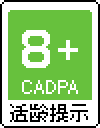
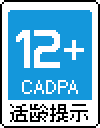
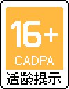
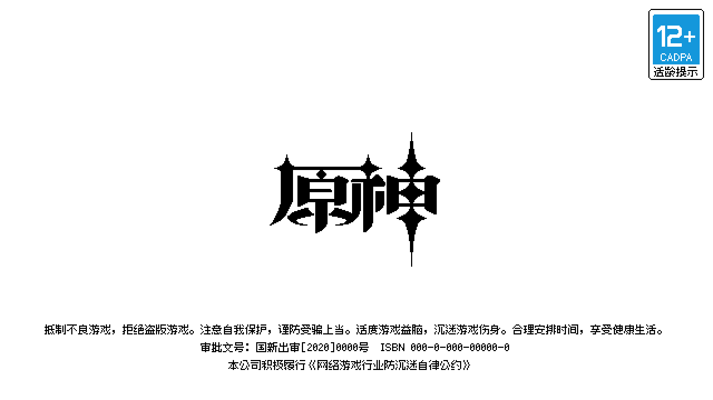

# 像素素材：电子游戏分级制度

各国家和地区的[「电子游戏分级制度」](https://zh.wikipedia.org/wiki/%E7%94%B5%E5%AD%90%E6%B8%B8%E6%88%8F%E5%88%86%E7%BA%A7%E5%88%B6%E5%BA%A6)标识的像素化素材。

注意：在最终产品中使用像素化标识代替原始标识有可能并不符合当地的法律规定。如果您想要这样使用，请务必对这一点进行确认。

## 各国家和地区分级规定

### 中国大陆

#### 中国音像与数字出版协会 - 网络游戏适龄提示 (CADPA)

http://jinbao.people.cn/GB/428398/index.html

### 日本

#### 计算机娱乐分级机构 (CERO)

https://www.cero.gr.jp/

## 使用例

以 640 * 360 为 1 倍设计尺寸

