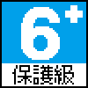
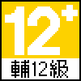
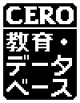
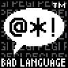

# 像素素材 - 电子游戏分级制度

各国家和地区的 [「电子游戏分级制度」](https://zh.wikipedia.org/wiki/%E7%94%B5%E5%AD%90%E6%B8%B8%E6%88%8F%E5%88%86%E7%BA%A7%E5%88%B6%E5%BA%A6) 相关图标的像素化素材。

素材尺寸大致在 50 ~ 64 像素，适用于 640 * 360 像素分辨率。

注意：在最终产品中使用像素图标代替原始的分级图标，有可能并不符合当地法规要求。如果您想要这样使用，请务必对这一点进行确认。

## 各国家和地区分级规定

### 中国大陆

#### 中国音像与数字出版协会 - 网络游戏适龄提示 (CADPA)

http://jinbao.people.cn/GB/428398/index.html

### 中国台湾

#### 游戏软件分级管理办法 (GSRR)

https://www.gamerating.org.tw

### 日本

#### 计算机娱乐分级机构 (CERO)

https://www.cero.gr.jp

### 欧洲

#### 泛欧洲游戏信息组织 (PEGI)

https://pegi.info

## 使用例

## 许可证

[CC BY-SA 4.0](LICENSE)
